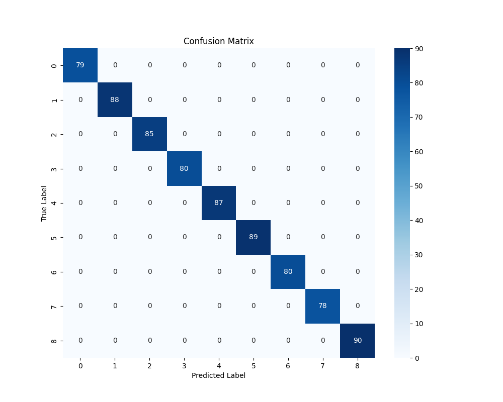
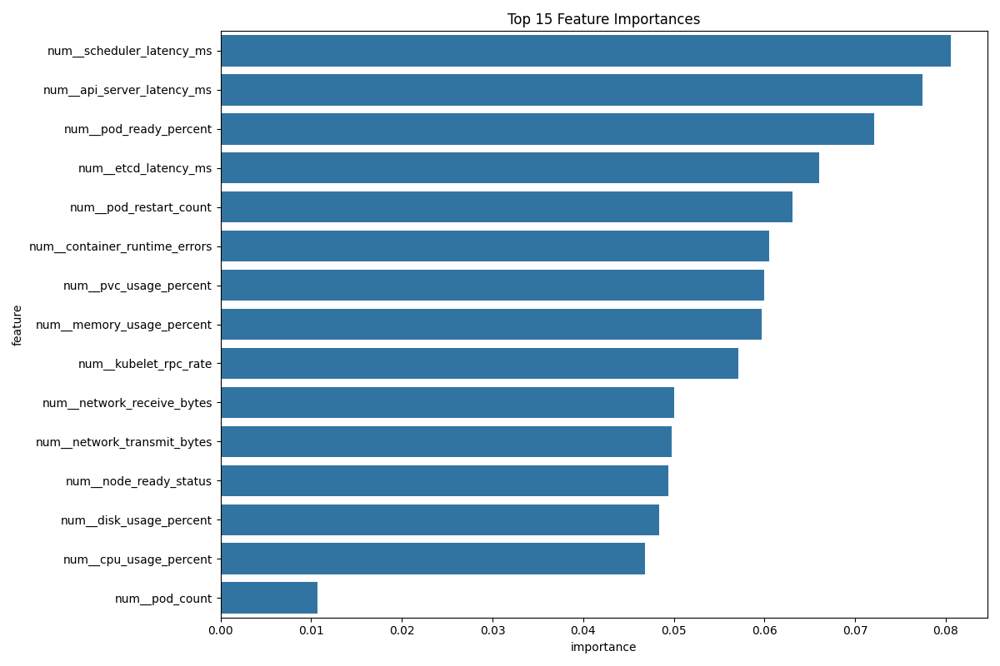

# Kubernetes Issue Prediction System

A machine learning system that predicts potential issues in Kubernetes clusters based on various metrics and telemetry data.

## Overview

This project implements a complete machine learning pipeline for detecting and predicting various types of issues in Kubernetes clusters. The system uses cluster metrics such as CPU/memory utilization, network latency, API server response times, and container error counts to identify patterns that precede different types of failures or performance degradations.

## Components

The project consists of two main components:

1. **Data Simulator (`kubernetes_data_simulator.py`)**: Generates synthetic Kubernetes metrics data that simulates normal operations and various failure scenarios.

2. **Prediction Model (`kubernetes_prediction_model.py`)**: Implements the machine learning pipeline for training models to predict Kubernetes issues based on metrics data.

## Architecture


The system follows this architecture:

1. **Data Ingestion**: Reads metrics data from CSV files
2. **Preprocessing Pipeline**: 
   - Handles missing values
   - Scales numerical features
   - Encodes categorical variables
   - Performs train/test splitting
3. **Model Training**: 
   - Primary model: Random Forest Classifier
   - Alternative model: Gradient Boosting Classifier
4. **Evaluation System**:
   - Classification metrics (accuracy, F1, etc.)
   - Confusion matrix visualization
   - Feature importance analysis
   - Performance logging

## Key Features

- Comprehensive data preprocessing pipeline
- Support for both categorical and numerical features
- Automated feature importance analysis
- Visualization of model performance
- Logging of training and evaluation processes
- Model persistence (save/load functionality)
- Robust error handling

## Results

The model demonstrates strong performance in predicting Kubernetes issues:

### Confusion Matrix


### Feature Importance


## Installation

```bash
# Clone the repository
git clone https://github.com/manojk0303/kubernetes-issue-prediction.git
cd kubernetes-issue-prediction

# Install required packages
pip install -r requirements.txt
```

## Usage

### Training a model

```python
from kubernetes_prediction_model import KubernetesPredictionModel

# Initialize the model
k8s_model = KubernetesPredictionModel(
    data_path="kubernetes_metrics_dataset.csv",
    model_path="kubernetes_prediction_model.joblib"
)

# Load and preprocess data
data = k8s_model.load_data()
X_train, X_test, y_train, y_test = k8s_model.preprocess_data(target_column='issue_type')

# Train model
model = k8s_model.train_model(X_train, y_train, model_type='random_forest')

# Evaluate model
evaluation = k8s_model.evaluate_model(X_test, y_test)

# Save model
k8s_model.save_model()
```

### Making predictions

```python
# Load a trained model
k8s_model = KubernetesPredictionModel(model_path="kubernetes_prediction_model.joblib")
k8s_model.load_model()

# Make predictions on new data
new_data = pd.read_csv("new_metrics.csv")
predictions = k8s_model.predict(new_data)
```

### Generate synthetic data (optional)

```python
from kubernetes_data_simulator import KubernetesDataSimulator

# Initialize simulator
simulator = KubernetesDataSimulator(
    num_samples=1000,
    time_periods=48,  # Hours of data
    issue_types=['pod_crash', 'memory_leak', 'network_latency', 'normal']
)

# Generate data
data = simulator.generate_dataset()

# Save to CSV
data.to_csv("kubernetes_metrics_dataset.csv", index=False)
```

## Dataset

The model requires a dataset with the following structure:

- A target column named `issue_type` (categorical)
- Multiple feature columns representing Kubernetes metrics (numerical and categorical)

### Example Metrics:

- `num_scheduler_latency_ms`: Scheduler latency in milliseconds
- `num_api_server_latency_ms`: API server latency in milliseconds
- `num_pod_ready_percent`: Percentage of pods in the ready state
- `num_etcd_latency_ms`: etcd latency in milliseconds
- `num_pod_restart_count`: Number of pod restarts
- `num_container_runtime_errors`: Count of container runtime errors
- And many more...

## Requirements

- Python 3.7+
- NumPy
- pandas
- scikit-learn
- matplotlib
- seaborn
- joblib

## Future Work

- Add support for time-series analysis
- Implement anomaly detection for unknown issues
- Create a real-time prediction API
- Integrate with Kubernetes monitoring systems (Prometheus, etc.)
- Expand to more issue types and failure scenarios

## License

[MIT License](LICENSE)

## Contributing

Contributions are welcome! Please feel free to submit a Pull Request.
